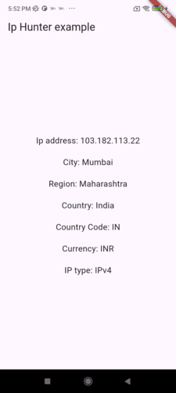

# ip_hunter
Fetch ip address, region and location info.

## Getting Started
Ip Hunter <br>
A Flutter package to retrieve the device's network IP address and fetch detailed location information, such as city, region, and 
country based on the connected network.

## Implementation
1. To use this package, add the package to your pubspec.yaml file:
```yaml
dependencies:
ip_hunter: ^1.0.0
```
2. Import the package :
```dart
import 'package:ip_hunter/ip_hunter.dart';
```
3. Usage: 
With future widget
```dart
FutureBuilder<String>(
  future: IpHunter.getPublicIPAddress(), // async work
  builder: (BuildContext context, AsyncSnapshot<String> snapshot) {
    switch (snapshot.connectionState) {
      case ConnectionState.waiting: return const Text('Loading....');
      default:
        if (snapshot.hasError) {
          return Text('Error: ${snapshot.error}');
        } else {
          return Text('IP: ${snapshot.data}', style: TextStyle(fontSize: 17),);
        }
    }
    },
),
```
A function with the method :
```dart
Future getIP() async {
  var ip = await IpHunter.getPublicIPAddress();
  print("ip is $ip");
  }
```

## Note:
Ensure your app has internet access, as this package requires network connectivity to fetch the IP and location details.
The package uses publicly available APIs to provide location details based on the network IP address.

## Details:
The package provides the following methods:

| Method                | Description                                   | Returns |
|-----------------------|-----------------------------------------------|:-------:|
| getNetworkIpAddress() | Fetches the network's IP address.             | String  |
| getCity()             | Retrieves the city associated with the IP.    | String  |
| getRegion()           | Retrieves the region/state for the IP.        | String  |
| getCountry()          | Retrieves the country associated with the IP. | String  |




Developed by: <br>
Pranav Patel <br>
Personal email - pranav.patel2001@gmail.com <br>
Work email - pranavp@fermion.in <br>
LinkedIn - https://www.linkedin.com/in/pranav-patel-7b06a4188 <br>
Publisher's Linkedin - https://www.linkedin.com/company/fermioninfotech?trk=profile-position
